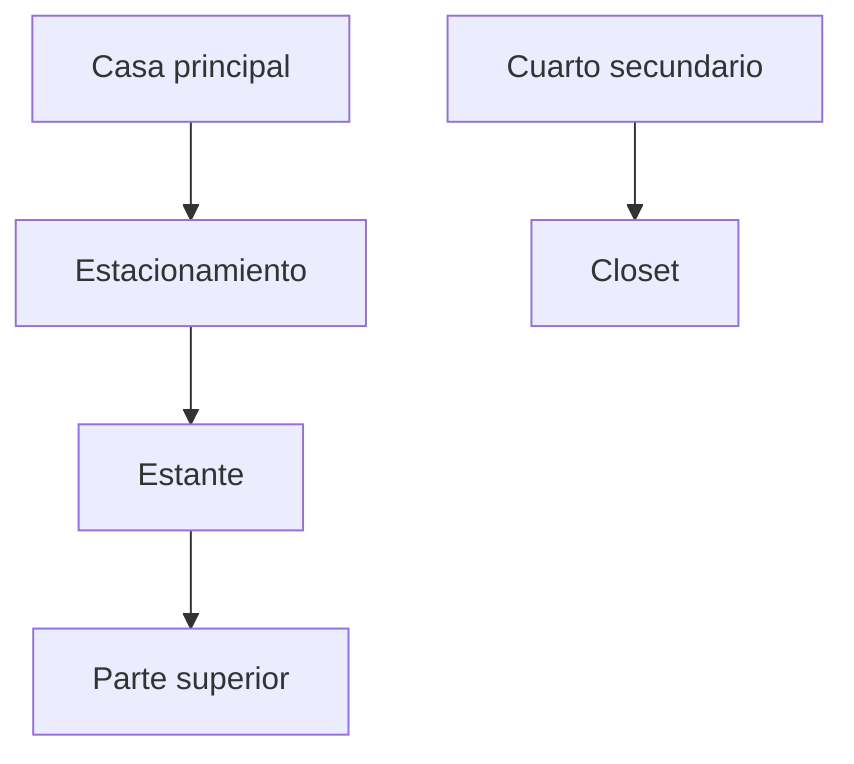
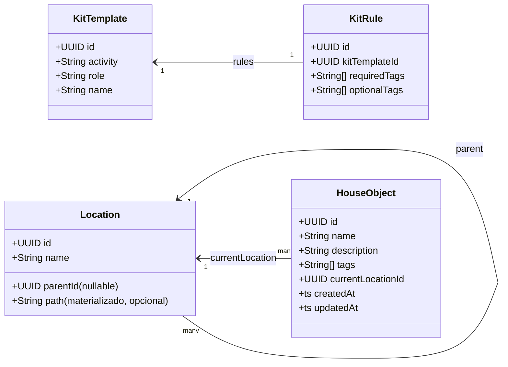
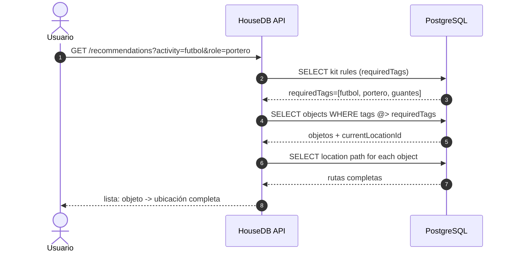
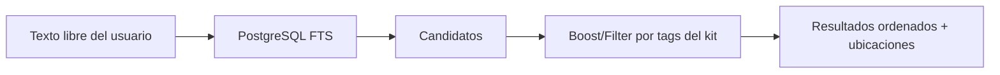

# Kiwi

[](https://github.com/rafex/kiwi/actions/workflows/build_backend_java.yml)
[](https://github.com/rafex/kiwi/actions/workflows/publish_container.yml)


Kiwi es un sistema de almacenamiento genérico orientado a registrar objetos, ubicaciones y eventos, con backend Java modular y persistencia en PostgreSQL gestionada con Flyway.

## HouseDB (idea y alcance del MVP)

HouseDB es un caso de uso concreto sobre Kiwi: **almacenar objetos del hogar y saber exactamente dónde están**, usando **ubicaciones jerárquicas** (tipo árbol) y **búsqueda por intención**.

Ejemplo mental:

- *Guantes de fútbol verdes* → Casa principal → Estacionamiento → Estante → Parte superior
- *Guantes de fútbol rojos* → Cuarto secundario → Closet

### Alcance

Este repositorio (Kiwi) es la base backend. Para el MVP de HouseDB se incluyen únicamente:

- **Paso 1 (MVP):** tags + plantillas de kits (reglas simples)
- **Paso 2 (pro):** búsqueda semántica con PostgreSQL (Full-Text Search)

> **Fuera de alcance por ahora:** embeddings / RAG (Paso 3).

### Conceptos

- **Object (Objeto):** entidad que describes (nombre, descripción, tags, etc.)
- **Location (Ubicación):** nodo del árbol (casa → cuarto → mueble → repisa, etc.)
- **KitTemplate (Plantilla de kit):** definición de “qué necesito” para una actividad + rol
  - Ej: actividad `futbol`, rol `portero` → requiere tags: `futbol`, `portero`, `guantes`

### Árbol de ubicaciones



### Modelo de datos (MVP)



### Flujo del MVP (tags + kit)

Cuando el usuario expresa una intención tipo:

> “Quiero ir a jugar fútbol y seré portero”

El sistema lo traduce a:

- activity=`futbol`
- role=`portero`
- requiredTags=`[futbol, portero, guantes]`

Y responde con una lista de objetos que cumplan (por tags) y su **ruta de ubicación**.



### Paso 2 (pro): búsqueda semántica (PostgreSQL FTS)

Además de tags, cada objeto puede tener una **descripción** y un **search_vector** (FTS) para permitir consultas naturales.

- Entrada del usuario: “equipo para jugar fútbol de portero”
- Estrategia:
  1) FTS para encontrar candidatos relevantes por texto
  2) Filtro/boost por tags del kit (si aplica)



#### Nota práctica

En el MVP, el “entendimiento” de intención se resuelve por **parámetros explícitos** (`activity`, `role`) o por una tabla de sinónimos simple.

## Objetivo del proyecto

- Proveer una base backend para gestión de inventario/objetos.
- Mantener una arquitectura limpia por módulos (puertos, core, infraestructura y transportes).
- Facilitar operación local mediante contenedor, variables de entorno y scripts de prueba.

## Licencia

Este proyecto está licenciado bajo **Apache License 2.0**.

- Texto completo: [LICENSE](LICENSE)

## Qué puedes encontrar aquí

- `backend/java`: backend Java multi-módulo (HTTP Jetty, seguridad JWT, observabilidad con Glowroot).
- `db`: migraciones y utilidades Flyway para esquema y seguridad de base de datos.
- `helm/kiwi-backend`: chart Helm para desplegar la imagen publicada en GHCR.
- `script/test`: scripts shell para pruebas rápidas de endpoints.
- `Makefile` raíz: utilidades para validar/exportar variables desde `.env`.

## Inicio rápido

1. Crea tu archivo de entorno desde el ejemplo:

	```bash
	cp .env.example .env
	```

2. Carga variables requeridas en tu shell:

	```bash
	eval "$(make print_env)"
	```

3. Ejecuta migraciones de base de datos:

	```bash
	cd db
	make migrate
	```

4. Construye y ejecuta el backend en contenedor:

	```bash
	cd ../backend/java
	make run-image
	```

## Índice de documentación

### Documentación principal

- [README del backend Java](backend/java/README.md)
- [Documentación técnica Java](backend/java/docs/README.md)
- [README de base de datos (Flyway)](db/README.md)
- [README del chart Helm](helm/kiwi-backend/README.md)

### Backend Java (módulos)

- [Agregador Maven (`kiwi-parent`)](backend/java/kiwi-parent/README.md)
- [kiwi-ports](backend/java/kiwi-parent/kiwi-ports/README.md)
- [kiwi-common](backend/java/kiwi-parent/kiwi-common/README.md)
- [kiwi-core](backend/java/kiwi-parent/kiwi-core/README.md)
- [kiwi-infra-postgres](backend/java/kiwi-parent/kiwi-infra-postgres/README.md)
- [kiwi-bootstrap](backend/java/kiwi-parent/kiwi-bootstrap/README.md)
- [kiwi-transport-jetty](backend/java/kiwi-parent/kiwi-transport-jetty/README.md)
- [kiwi-transport-grpc](backend/java/kiwi-parent/kiwi-transport-grpc/README.md)
- [kiwi-transport-rabbitmq](backend/java/kiwi-parent/kiwi-transport-rabbitmq/README.md)
- [kiwi-tools](backend/java/kiwi-parent/kiwi-tools/README.md)

## Variables de entorno clave

Definidas en [.env.example](.env.example):

- DB/Flyway: `FLYWAY_URL`, `FLYWAY_USER`, `FLYWAY_PASSWORD`, `DB_URL`, `DB_USER`, `DB_PASSWORD`
- JWT: `JWT_ISS`, `JWT_AUD`, `JWT_SECRET`, `JWT_TTL_SECONDS`, `JWT_APP_TTL_SECONDS`
- Provisioning: `ENVIRONMENT`, `ENABLE_USER_PROVISIONING`, `BOOTSTRAP_TOKEN`

## Pruebas rápidas

Scripts disponibles en [script/test](script/test):

- `health.sh`
- `auth_app.sh`
- `create_app_client.sh`
- `say_hello.sh`
- `create_object.sh`
- `search.sh`
- `fuzzy.sh`

## Publicación de contenedor (GHCR)

La publicación del backend en GitHub Actions usa versionado por tag Git con formato:

- `vN.YYYYmmDD` (ejemplos: `v1.20260222`, `v2.20260222`)

Comandos para crear y publicar una versión:

```bash
	git tag v2.$(date +%Y%m%d)
git push origin --tags
```

La imagen se publica en `ghcr.io/<owner>/kiwi-jetty-backend` con:

- tag de versión (`vN.YYYYmmDD`)
- tag de commit (`<sha>`)
