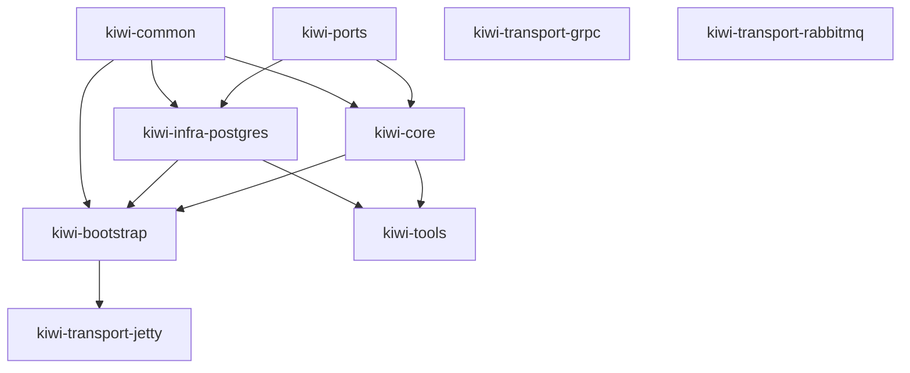
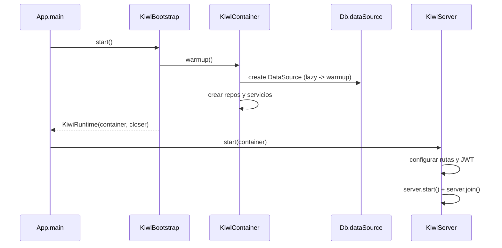
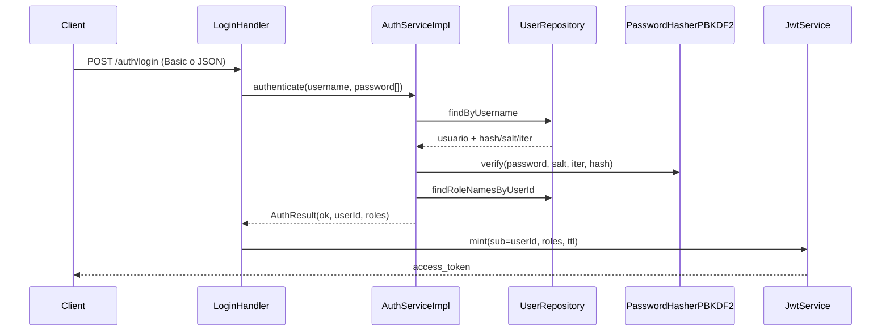

# Arquitectura y módulos

## Resumen

El backend Java usa arquitectura modular por capas:

- **Puertos** (`kiwi-ports`): contratos de repositorio.
- **Core** (`kiwi-core`): casos de uso y reglas de negocio.
- **Infraestructura** (`kiwi-infra-postgres`): implementación JDBC/PostgreSQL.
- **Composición** (`kiwi-bootstrap`): wiring y lifecycle.
- **Transporte** (`kiwi-transport-jetty`): API HTTP y seguridad JWT.
- **Extensiones** (`kiwi-transport-grpc`, `kiwi-transport-rabbitmq`): placeholders.
- **Herramientas** (`kiwi-tools`): utilidades ejecutables.

## Stack técnico (fuente: kiwi-parent/pom.xml)

- Java: **21** (`maven.compiler.release=21`)
- Build: Maven Wrapper (`./mvnw`) + agregador multi-módulo
- HTTP server: Jetty **12.1.6**
- JSON: Jackson **2.21.0**
- DB: PostgreSQL JDBC **42.7.9** + HikariCP **5.1.0**
- Logging: SLF4J JDK14 **2.0.17**
- Testing: JUnit **6.0.3**, Mockito **5.14.2**, AssertJ **3.26.3**
- Observabilidad: Glowroot agent API **0.14.0-beta.3**

## Módulos y dependencias directas

| Módulo | Rol | Dependencias directas relevantes |
|---|---|---|
| `kiwi-ports` | Contratos | `jackson-annotations` |
| `kiwi-common` | Utilidades compartidas | `jackson-databind` (provided) |
| `kiwi-core` | Lógica de negocio | `kiwi-common`, `kiwi-ports` |
| `kiwi-infra-postgres` | Persistencia PostgreSQL | `kiwi-common`, `kiwi-ports`, `postgresql`, `HikariCP` |
| `kiwi-bootstrap` | Composición de dependencias | `kiwi-common`, `kiwi-core`, `kiwi-infra-postgres` |
| `kiwi-transport-jetty` | Transporte HTTP principal | `kiwi-bootstrap`, `jetty-server`, `jackson-databind`, JWT |
| `kiwi-transport-grpc` | Placeholder gRPC | sin deps específicas aún |
| `kiwi-transport-rabbitmq` | Placeholder RabbitMQ | sin deps específicas aún |
| `kiwi-tools` | Herramientas CLI | `kiwi-infra-postgres`, `kiwi-core` |

## Diagrama de componentes

## Flujo de arranque

## Flujo de autenticación (login)

## Notas técnicas

- `kiwi-transport-jetty` define `main.class=dev.rafex.kiwi.App`.
- Se genera fat JAR con `maven-assembly-plugin`.
- `kiwi-tools` también declara `main.class` para utilidades.
- En `CreateUserHandler`, la validación de rol admin hoy revisa `"admin"` en minúsculas; conviene mantener consistencia con nombres de rol de base de datos.
