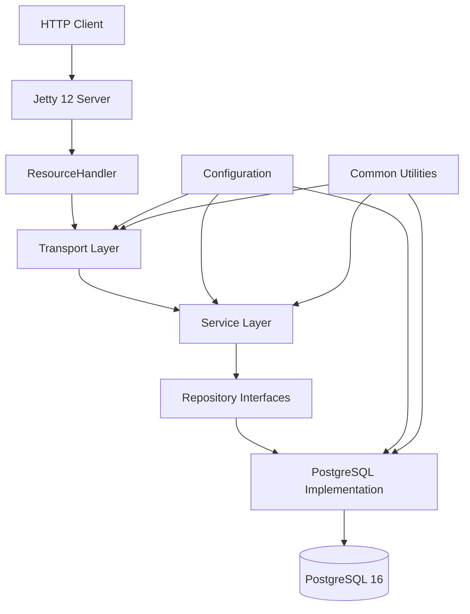

# Architecture

## Style
Hexagonal (Ports & Adapters) with clean separation between domain, application, infrastructure, and transport layers.

## Layers
| Layer | Package/Dir | Responsibility |
|-------|-------------|----------------|
| Domain | `kiwi-core` | Core business logic, entities, services |
| Ports (Interfaces) | `kiwi-ports` | Repository and service interfaces |
| Infrastructure | `kiwi-infra-postgres` | PostgreSQL implementations of repositories |
| Transport | `kiwi-transport-jetty` | HTTP handlers, routing, Jetty 12 server |
| Common | `kiwi-common` | Shared utilities, configuration, logging |
| Bootstrap | `kiwi-bootstrap` | Application entry point, dependency injection |
| Tools | `kiwi-tools` | CLI utilities, admin tools |

## Key Patterns
- **Repository Pattern**: Data access abstraction through interfaces in `kiwi-ports`, implementations in `kiwi-infra-postgres`
- **Service Layer**: Business logic in `kiwi-core/services` with interfaces and implementations
- **Dependency Injection**: Manual DI through constructors, no framework dependencies
- **RSQL Filtering**: Lightweight RSQL parser for safe query building
- **QuerySpec Abstraction**: Unified query parameter handling with validation
- **Safe SQL Generation**: All SQL uses PreparedStatements, no raw concatenation

## Components

## Testing Strategy
- **Testcontainers 1.19.7** for containerized testing
- **BasePostgresTest** base class for database tests
- **JUnit 5** for unit and integration tests
- **Spotless** for code formatting
- **Checkstyle** for code quality
- **OWASP Dependency Check** for security scanning

## Database
- **PostgreSQL 16** with array types and JSONB support
- **Flyway** for schema migrations (`db/sql/` directory)
- **PreparedStatements only** for security
- **Field whitelisting** for all dynamic queries
- **Transaction management** at service layer