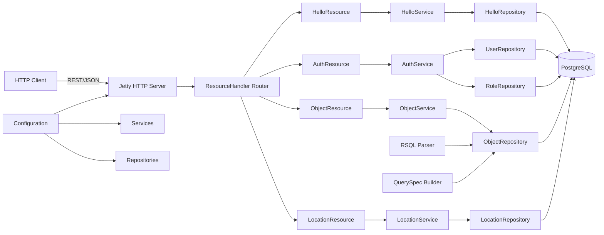
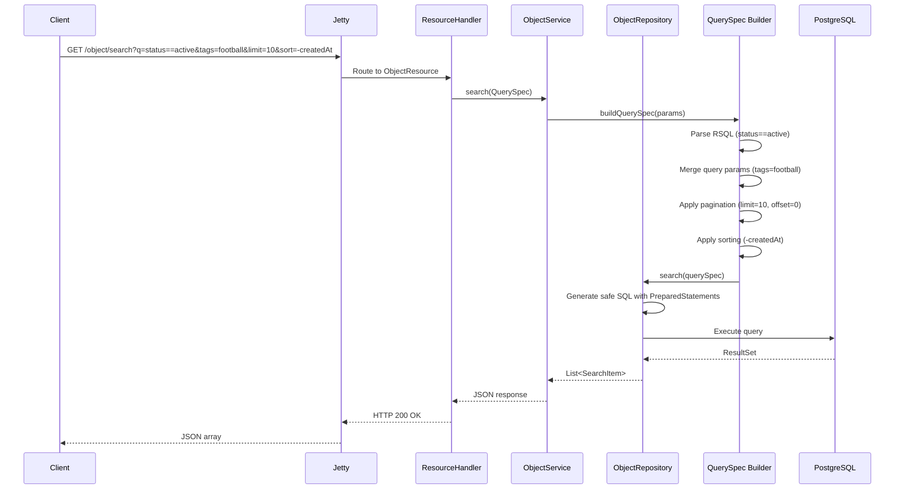
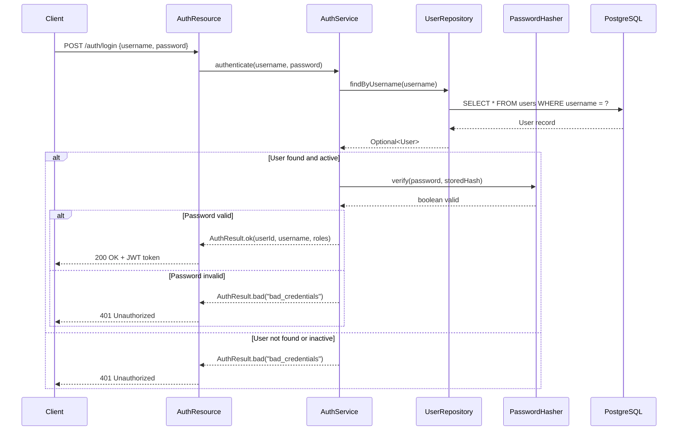
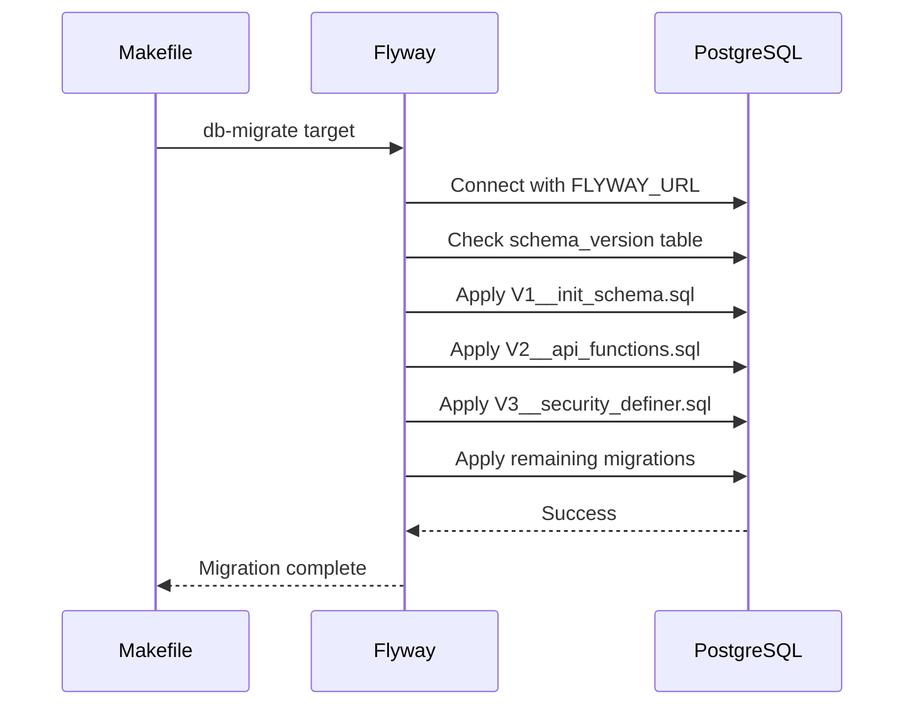

# System Design

## Overview
Kiwi is a lightweight HTTP backend with RSQL filtering capabilities, designed for resource-based APIs with complex query requirements. It provides a hexagonal architecture implementation with Jetty 12 and Java 25.

## Components

## Key Flows

### Object Search with RSQL Filtering

### Authentication Flow

### Database Migration Flow

## Scalability Notes
- **Stateless architecture**: All state in PostgreSQL, session tokens in JWTs
- **Connection pooling**: HikariCP for database connections
- **Query optimization**: RSQL parsing happens in-memory, SQL generation uses indexes
- **Container-ready**: Docker images with multi-stage builds
- **Helm charts**: Kubernetes deployment templates in `helm/kiwi-backend/`

## Security Model
- **Password hashing**: PBKDF2-HMAC-SHA256 with configurable iterations
- **JWT tokens**: Stateless authentication with configurable expiration
- **Field whitelisting**: All dynamic query fields must be explicitly allowed
- **PreparedStatements**: SQL injection protection
- **Input validation**: All parameters validated before processing
- **Role-based access**: PostgreSQL roles with least privilege