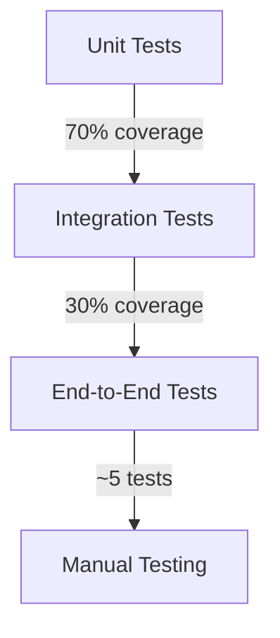

# Testing Strategy

## Overview

We use **containerized testing** with Testcontainers to execute tests against real dependencies. This approach ensures:
- Tests run against production-like environments
- Eliminates the need for mocks in integration tests
- Consistent test execution across all environments

## Test Pyramid



### Unit Tests (70% of tests)
- Fast tests focusing on individual classes
- Use mocks for dependencies
- Located in `src/test/java`

### Integration Tests (30% of tests)
- Test interactions between components
- Use real databases via Testcontainers
- Extend `BasePostgresTest`
- Located in `src/test/java` with `*IT` suffix

### End-to-End Tests
- Test full HTTP request/response flow
- Use TestClient to call local API endpoints

## Testcontainers Integration

### Dependencies
```xml
<dependency>
    <groupId>org.testcontainers</groupId>
    <artifactId>testcontainers</artifactId>
    <version>1.19.7</version>
    <scope>test</scope>
</dependency>
<dependency>
    <groupId>org.testcontainers</groupId>
    <artifactId>postgresql</artifactId>
    <version>1.19.7</version>
    <scope>test</scope>
</dependency>
```

### Base Test Class
```java
public abstract class BasePostgresTest {
    @Container
    public static PostgreSQLContainer<?> postgreSQLContainer = 
        new PostgreSQLContainer<>("postgres:16-alpine")
            .withDatabaseName("testdb")
            .withUsername("test")
            .withPassword("test");

    @BeforeAll
    static void beforeAll() {
        System.setProperty("DB_URL", postgreSQLContainer.getJdbcUrl());
        System.setProperty("DB_USER", postgreSQLContainer.getUsername());
        System.setProperty("DB_PASSWORD", postgreSQLContainer.getPassword());
    }
}
```

### Example Test
```java
class DatabaseConfigTest extends BasePostgresTest {
    @Test
    void shouldConnectToDatabase() {
        // Given
        DatabaseConfig config = new DatabaseConfig(
            postgreSQLContainer.getJdbcUrl(),
            postgreSQLContainer.getUsername(),
            postgreSQLContainer.getPassword()
        );
        
        // When
        try (Connection connection = config.dataSource().getConnection()) {
            // Then
            assertTrue(connection.isValid(5));
        }
    }
}
```

## Running Tests

```bash
# Run all tests
./mvnw test

# Run specific test class
./mvnw test -Dtest="DatabaseConfigTest"

# Run integration tests only
./mvnw test -Dgroups="integration"

# Run with test containers in CI mode
./mvnw test -Dtestcontainers.reuse.enable=false
```

## Best Practices
1. Always extend `BasePostgresTest` for database tests
2. Use JUnit 5 lifecycle annotations
3. Tag tests with `@Tag("integration")` for integration tests
4. Clean database state before each test
5. Prefer testing against real dependencies over mocks

## CI Integration
Testcontainers works seamlessly with GitHub Actions. Containers start automatically during the test phase.

## Troubleshooting
- If containers don't start, check Docker is running
- Use `reuse.enable=true` for faster local development
- Increase test timeout if needed with `@Test(timeout = 10000)`